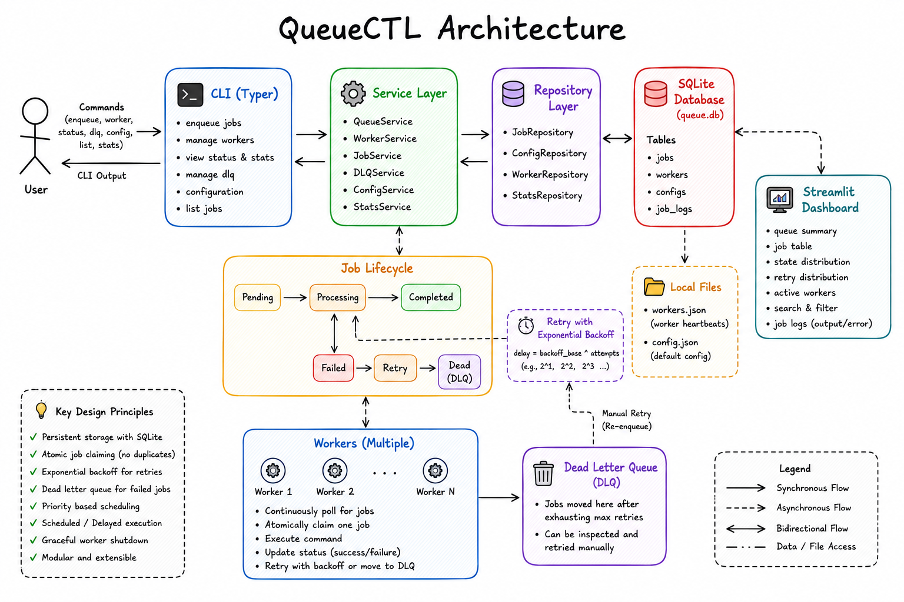

# QueueCTL

<p align="center">


**A production-style persistent background job queue with retries, dead letter queues, scheduling, priority queues, multiple workers, and live monitoring.**

</p>

---

# Architecture



---

# Overview

QueueCTL is a lightweight production-inspired background job queue built entirely in Python.

It allows users to enqueue shell commands, execute them asynchronously using one or more workers, retry failed jobs with exponential backoff, automatically move permanently failed jobs into a Dead Letter Queue (DLQ), schedule jobs for future execution, assign priorities to jobs, and monitor the queue through a live dashboard.

All jobs are persisted in SQLite, ensuring they survive application restarts.

---

# Features

## Core Features

- Persistent SQLite job storage
- Multiple concurrent workers
- Atomic job claiming
- Retry mechanism with exponential backoff
- Dead Letter Queue (DLQ)
- Configurable polling interval
- Configurable retry count
- Graceful worker shutdown
- Rich CLI interface
- Live monitoring dashboard

## Additional Features

- Priority-based scheduling
- Scheduled / delayed jobs
- Job output & error logging
- Queue statistics
- Streamlit dashboard

---

# Project Structure

```text
queuectl/

├── app/
│   ├── cli/
│   ├── core/
│   ├── db/
│   ├── services/
│   └── dashboard/
│
├── data/
│   ├── queue.db
│   └── workers.json
│
├── tests/
├── config.json
├── dashboard.py
├── main.py
└── README.md
```

---

# Job Lifecycle

```text
Pending
   │
   ▼
Processing
   │
   ├──────────────► Completed
   │
   ▼
Failed
   │
Retries Left?
   │
   ├── Yes
   │      │
   │      ▼
   │  Exponential Backoff
   │      │
   │      ▼
   │   Pending
   │
   └── No
          │
          ▼
        Dead Letter Queue
          │
          ▼
     Manual Retry
```

---

# Installation

```bash
git clone <repository-url>

cd queuectl

python -m venv .venv

# Windows
.venv\Scripts\activate

# Linux/macOS
source .venv/bin/activate

pip install -r requirements.txt
```

Run QueueCTL

```bash
python main.py --help
```

Launch dashboard

```bash
streamlit run dashboard.py
```

---

# CLI Examples

Enqueue

```bash
python main.py enqueue add --command "echo Hello"
```

Priority Job

```bash
python main.py enqueue add \
    --command "echo Urgent" \
    --priority 10
```

Delayed Job

```bash
python main.py enqueue add \
    --command "echo Later" \
    --delay 30
```

Scheduled Job

```bash
python main.py enqueue add \
    --command "echo Future" \
    --run-at "2026-07-07T18:00:00"
```

Start Workers

```bash
python main.py worker start --count 4
```

Status

```bash
python main.py status
```

DLQ

```bash
python main.py dlq list

python main.py dlq retry job1
```

Configuration

```bash
python main.py config show

python main.py config set max-retries 5
```

---

# Configuration

Example

```json
{
    "poll_interval": 5,
    "max_retries": 3,
    "backoff_base": 2
}
```

Retry delay

```text
delay = backoff_base ^ attempts
```

---

# Worker Execution

Each worker continuously:

1. Polls the queue
2. Atomically claims one eligible job
3. Executes the command
4. Marks success **or**
5. Schedules retry **or**
6. Moves the job to the Dead Letter Queue

---

# Atomic Job Claiming

QueueCTL prevents duplicate execution using SQLite transactions.

Each worker executes:

```sql
BEGIN IMMEDIATE
```

followed by a single

```sql
UPDATE ... RETURNING
```

statement.

This guarantees only one worker can claim a job, even when multiple workers poll simultaneously.

---

# Priority Scheduling

Jobs may be assigned a priority.

Higher priority jobs are executed before lower priority jobs.

```sql
ORDER BY
priority DESC,
created_at ASC
```

---

# Scheduled Jobs

QueueCTL supports both delayed and absolute scheduling.

Examples

```bash
--delay 60
```

or

```bash
--run-at "2026-07-07T15:30:00"
```

Workers automatically wait until

```text
next_run_at <= current_time
```

before claiming a scheduled job.

---

# Monitoring Dashboard

The Streamlit dashboard provides live visibility into the queue.

Features include:

- Queue summary
- Active workers
- Queue statistics
- Job table
- State filtering
- Job search
- Output & error inspection
- Auto refresh

Launch using

```bash
streamlit run dashboard.py
```

---

# Design Decisions

- SQLite chosen for simplicity and persistence
- Repository pattern separates persistence from business logic
- Atomic SQLite transactions prevent duplicate processing
- Worker registry enables graceful shutdown and worker monitoring
- Dashboard implemented separately using Streamlit

---

# Trade-offs

Current implementation intentionally favors simplicity over distributed scalability.

Known trade-offs include:

- SQLite instead of PostgreSQL/Redis
- File-based worker registry
- No job cancellation
- No timeout enforcement
- Dashboard is read-only

---

# Future Improvements

Possible enhancements include:

- Job timeout handling
- REST API
- Docker support
- Redis backend
- PostgreSQL support
- Cron scheduling
- Prometheus metrics
- Grafana dashboards
- Kubernetes deployment

---

# Demo

A short demonstration should showcase:

- Enqueueing jobs
- Worker execution
- Retry behaviour
- Dead Letter Queue
- Priority scheduling
- Scheduled jobs
- Dashboard monitoring

**Demo Recording**

> Add Google Drive link before submission.

---

# Author

**Abir Shrivastava**

B.E. Electronics & Instrumentation

BITS Pilani Hyderabad Campus

GitHub

```
https://github.com/abshhh
```

---

# License

This project was developed as part of the Flam Backend Developer Internship Assignment.